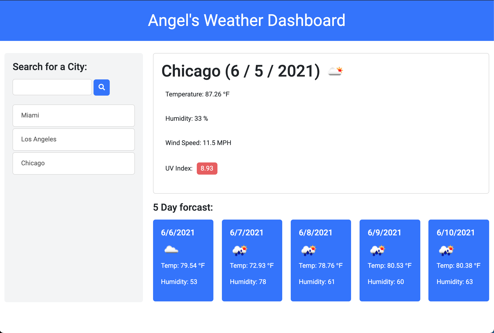

# Weather Dashboard

## Description
This weather app was created for anybody that like to check the weather
online. Gone are the days when people would have to wait in front of their
tv until the weatherman gave everyone the 5-Day Forecast. With this application
any user can go to the live site and use the search bar to type in any city.
A current day and a 5-Day forecast will populate for the user as they click the
search button.

## Technologies Used
- CSS Framework: Bootstrap
- Api: OpenWeather One Call Api
- HTML, JS and CSS. 

[Link to the weather!](https://angelfloreschicago.github.io/hw6_WeatherDashboard/)

